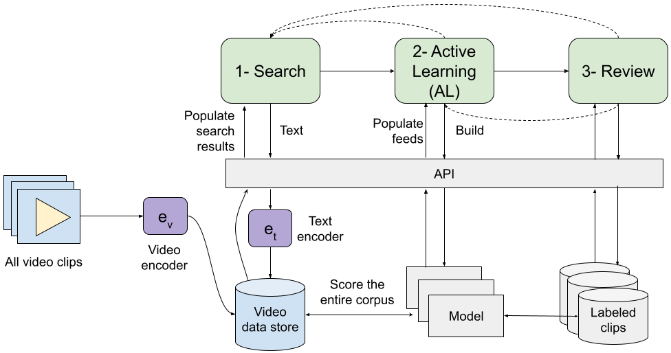

# Video Annotator

## Video understanding

Here's a quick demo to get started:
```python
from videoannotator import data, models
import numpy as np

# pick a label to work with
label = "car-chase"

# grab the annotated dataset for the label
dataset = data.get_aggregate_labeled_dataset(label=label)

# train a classifier with the labeled data
clf = models.LogisticRegression(scoring='average_precision')
clf.fit(dataset.x, dataset.y)

# get the video embedding for your clip
np.random.seed(0)
emb = np.random.rand(1, 512)

# score is between 0 and 1
# higher score means that the clip is more likely to contain to `label`
score = clf.predict_proba(emb).item()
```

See more details in [this notebook](demo.ipynb).

## What is Video Annotator?

The best source is our paper [here](https://arxiv.org/abs/2402.06560). Here's the abstract:

> High-quality and consistent annotations are fundamental to the successful development of robust machine learning models. Traditional data annotation methods are resource-intensive and inefficient, often leading to a reliance on third-party annotators who are not the domain experts. Hard samples, which are usually the most informative for model training, tend to be difficult to label accurately and consistently without business context. These can arise unpredictably during the annotation process, requiring a variable number of iterations and rounds of feedback, leading to unforeseen expenses and time commitments to guarantee quality.
> 
>We posit that more direct involvement of domain experts, using a human-in-the-loop system, can resolve many of these practical challenges. We propose a novel framework we call Video Annotator (VA) for annotating, managing, and iterating on video classification datasets. Our approach offers a new paradigm for an end-user-centered model development process, enhancing the efficiency, usability, and effectiveness of video classifiers. Uniquely, VA allows for a continuous annotation process, seamlessly integrating data collection and model training.
> 
> We leverage the zero-shot capabilities of vision-language foundation models combined with active learning techniques, and demonstrate that VA enables the efficient creation of high-quality models. VA achieves a median 6.8 point improvement in Average Precision relative to the most competitive baseline across a wide-ranging assortment of tasks. We release a dataset with 153k labels across 56 video understanding tasks annotated by three professional video editors using VA, and also release code to replicate our experiments.

## System


## Data

1. Download the data tar file from [here](https://drive.google.com/file/d/107Dm1UBYQ8UOSs9rcLA1TGExYKbcg7IA/view) and unpack into your folder of choice.
2. Set `DATA_BASE_PATH` to that folder in `videoannotator/config.py`. E.g. `/root/data/videoannotator/`.
3. View [this notebook](data-exploration.ipynb) to understand how the data is organized.

Once unpacked, the data should look like this:
```
├── videoannotator
│   ├── agg
│   │   ├── action.json
│   │   ├── aerial.json
│   │   ├── ...
│   ├── ave
│   │   ├── keys-to-labels.json
│   │   ├── labels-mapped.json
│   │   ├── ...
│   ├── checkpoints
│   │   ├── action.json
│   │   ├── aerial.json
│   │   ├── ...
│   ├── cmp
│   │   ├── action.json
│   │   ├── aerial.json
│   │   ├── ...
│   ├── embeddings.h5
│   ├── queries.json
│   ├── shot-data.csv
│   ├── text-embeddings.json
```

## Environment setup
```shell
conda env create -f conda_env.yml
conda activate videoannotator
```

## Running experiments
- [Experiment 1 notebook](exp1.ipynb)
- [Experiment 2 notebook](exp2.ipynb)

## Citation

If you find this work useful, please consider citing:

```bibtex
@misc{ziai2024video,
      title={Video Annotator: A framework for efficiently building video classifiers using vision-language models and active learning}, 
      author={Amir Ziai and Aneesh Vartakavi},
      year={2024},
      eprint={2402.06560},
      archivePrefix={arXiv},
      primaryClass={cs.CV}
}
```
